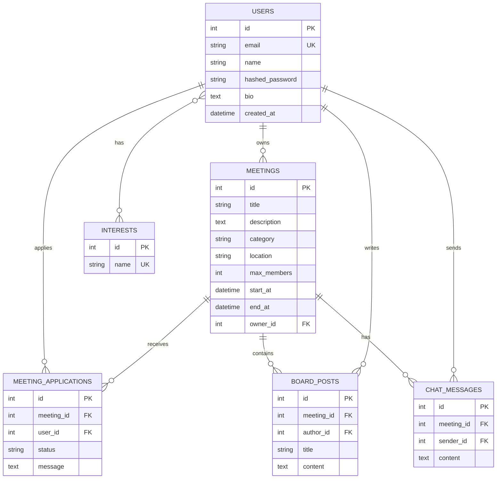

# 이음

팀 `알잘딱깔센`의 2026학년도 1학기 캡스톤 디자인 프로젝트입니다.

2026학년도 1학기 캡스톤 디자인 프로젝트용 FastAPI + SQLite 기반 모임 매칭 앱입니다.

## ERD 요약



핵심 관계는 다음과 같습니다.

- 사용자는 여러 관심 분야를 가질 수 있고, 관심 분야는 여러 사용자에게 연결됩니다.
- 사용자는 모임을 생성할 수 있으며, 생성자는 자동으로 승인된 참여자로 등록됩니다.
- 참여 신청은 `pending`, `approved`, `rejected` 상태로 관리됩니다.
- 추천 로직은 현재 사용자의 관심 분야와 모임 카테고리를 우선 매칭하고 가까운 일정을 함께 고려합니다.
- 게시판과 채팅 메시지는 사용자 및 모임과 연결되어 커뮤니케이션 이력을 남깁니다.

## 실행 방법

```bash
python -m venv .venv
source .venv/bin/activate
pip install -r requirements.txt
uvicorn main:app --reload
```

브라우저에서 `http://127.0.0.1:8000`으로 접속하면 기본 프론트엔드를 확인할 수 있습니다.

API 문서는 `http://127.0.0.1:8000/docs`에서 확인할 수 있습니다.
