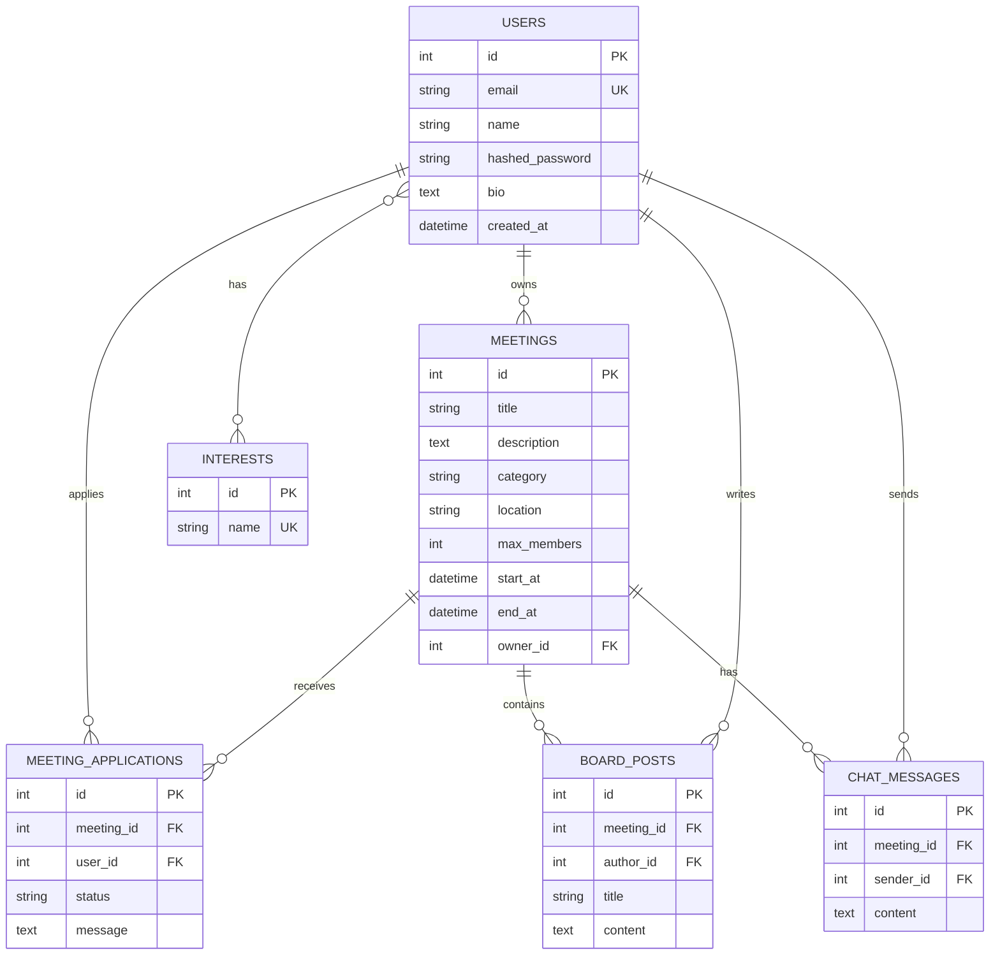

# 이음

팀 `알잘딱깔센`의 2026학년도 1학기 캡스톤 디자인 프로젝트입니다.

2026학년도 1학기 캡스톤 디자인 프로젝트용 FastAPI + SQLite 기반 모임 매칭 앱입니다.

## ERD 요약


```mermaid
erDiagram
    USERS ||--o{ MEETINGS : owns
    USERS ||--o{ MEETING_APPLICATIONS : applies
    USERS }o--o{ INTERESTS : has
    MEETINGS ||--o{ MEETING_APPLICATIONS : receives
    MEETINGS ||--o{ BOARD_POSTS : contains
    MEETINGS ||--o{ CHAT_MESSAGES : has
    USERS ||--o{ BOARD_POSTS : writes
    USERS ||--o{ CHAT_MESSAGES : sends

    USERS {
        int id PK
        string email UK
        string name
        string hashed_password
        text bio
        datetime created_at
    }
    INTERESTS {
        int id PK
        string name UK
    }
    MEETINGS {
        int id PK
        string title
        text description
        string category
        string location
        int max_members
        datetime start_at
        datetime end_at
        int owner_id FK
    }
    MEETING_APPLICATIONS {
        int id PK
        int meeting_id FK
        int user_id FK
        string status
        text message
    }
    BOARD_POSTS {
        int id PK
        int meeting_id FK
        int author_id FK
        string title
        text content
    }
    CHAT_MESSAGES {
        int id PK
        int meeting_id FK
        int sender_id FK
        text content
    }
```

핵심 관계는 다음과 같습니다.

- 사용자는 여러 관심 분야를 가질 수 있고, 관심 분야는 여러 사용자에게 연결됩니다.
- 사용자는 모임을 생성할 수 있으며, 생성자는 자동으로 승인된 참여자로 등록됩니다.
- 참여 신청은 `pending`, `approved`, `rejected` 상태로 관리됩니다.
- 추천 로직은 현재 사용자의 관심 분야와 모임 카테고리를 우선 매칭하고 가까운 일정을 함께 고려합니다.
- 게시판과 채팅 메시지는 사용자 및 모임과 연결되어 커뮤니케이션 이력을 남깁니다.

## Gemini 맞춤 추천 설정

프로젝트 루트에 `.env` 파일을 만들고 Google AI Studio에서 발급한 API 키를 넣습니다.

```bash
cp .env.example .env
# .env 파일에서 GEMINI_API_KEY=... 값을 설정
```

키가 없으면 관심사·카테고리 기반 기본 추천으로 동작합니다.

## 실행 방법

1. 프로젝트 폴더로 이동
2. npm install
3. npm run dev

브라우저에서 `http://127.0.0.1:8000`으로 접속하면 기본 프론트엔드를 확인할 수 있습니다.

API 문서는 `http://127.0.0.1:8000/docs`에서 확인할 수 있습니다.

## 팀원 접속 방법

같은 Wi-Fi에 연결된 팀원이 접속하려면 서버를 실행한 컴퓨터의 내부 IP 주소를 사용합니다.

```bash
ipconfig getifaddr en0
```

예를 들어 IP가 `192.168.184.39`라면 팀원은 브라우저에서 아래 주소로 접속합니다.

```text
http://192.168.184.39:8000
```

접속이 안 되면 다음을 확인합니다.

- 팀원 기기와 서버 컴퓨터가 같은 Wi-Fi에 연결되어 있는지 확인합니다.
- macOS 방화벽이 켜져 있다면 Python 또는 uvicorn의 수신 연결을 허용합니다.
- 학교/공공 Wi-Fi처럼 기기 간 통신을 막는 네트워크에서는 같은 Wi-Fi여도 접속이 안 될 수 있습니다.
- 다른 네트워크에서도 접속해야 한다면 ngrok, Cloudflare Tunnel 같은 터널링 도구가 필요합니다.
